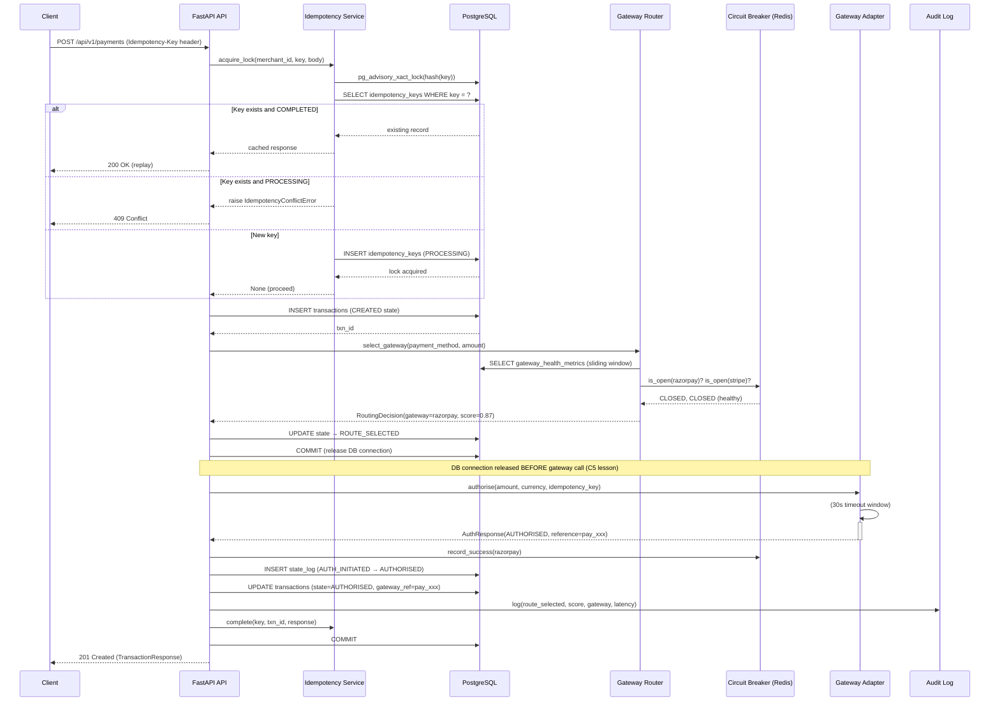

# PayFlow Payment Orchestration — Architecture Document

## System Overview

PayFlow is a production-grade payment orchestration layer that routes transactions across
Razorpay, Stripe, PayU, and UPI with intelligent multi-criteria routing, sub-2-second failover,
and complete audit trails. It processes 100K+ transactions/day for D2C e-commerce.

---

## High-Level Architecture

```
┌─────────────────────────────────────────────────────────────────────┐
│                         CLIENT APPLICATIONS                         │
│                  (Merchant Backend / Mobile App)                    │
└───────────────────────────────┬─────────────────────────────────────┘
                                │ HTTPS + X-API-Key + Idempotency-Key
                                ▼
┌─────────────────────────────────────────────────────────────────────┐
│                       FASTAPI API GATEWAY                           │
│  ┌──────────┐  ┌──────────┐  ┌──────────┐  ┌────────────────────┐  │
│  │ /payments│  │/webhooks │  │/gateways │  │/reconciliation     │  │
│  └──────────┘  └──────────┘  └──────────┘  └────────────────────┘  │
│                    Request Tracing Middleware                        │
│                    API Key Auth Middleware                           │
└───────────────────────────────┬─────────────────────────────────────┘
                                │
                                ▼
┌─────────────────────────────────────────────────────────────────────┐
│                    PAYMENT ORCHESTRATOR SERVICE                      │
│  ┌─────────────────┐    ┌──────────────────┐    ┌────────────────┐  │
│  │ Idempotency     │    │ State Machine    │    │ Audit Logger   │  │
│  │ Service         │    │ (FSM)            │    │                │  │
│  └────────┬────────┘    └───────┬──────────┘    └────────────────┘  │
│           │                    │                                     │
│  ┌────────▼────────┐    ┌───────▼──────────┐                        │
│  │ PostgreSQL      │    │ Failover Router  │                        │
│  │ Advisory Locks  │    │                  │                        │
│  └─────────────────┘    └───────┬──────────┘                        │
└───────────────────────────────┬─┴────────────────────────────────────┘
                                │
                    ┌───────────▼───────────┐
                    │   GATEWAY ROUTER      │
                    │  Multi-criteria score │
                    │  Circuit breaker gate │
                    └───────────┬───────────┘
                                │
         ┌──────────┬───────────┼───────────┬──────────┐
         ▼          ▼           ▼           ▼          ▼
    ┌─────────┐ ┌────────┐ ┌───────┐ ┌────────┐  ┌─────────┐
    │Razorpay │ │ Stripe │ │ PayU  │ │  UPI   │  │CB State │
    │Adapter  │ │Adapter │ │Adapter│ │Adapter │  │(Redis)  │
    └─────────┘ └────────┘ └───────┘ └────────┘  └─────────┘
         │          │           │           │
         └──────────┴───────────┴───────────┘
                         │
                    ┌────▼─────┐
                    │  MOCK    │
                    │ GATEWAYS │
                    │(Simulator)│
                    └──────────┘

┌─────────────────────────────────────────────────────────────────────┐
│                     ASYNC PROCESSING LAYER                          │
│                                                                     │
│  Webhook Ingest → webhook_queue (PostgreSQL)                        │
│                          ↓                                          │
│              Celery Worker (process_webhook_event)                  │
│                          ↓                                          │
│  [Signature Verify] → [Dedup Check] → [FSM Transition] → [Audit]   │
│                          ↓                                          │
│              Dead Letter Queue (on 3 failures)                      │
│                                                                     │
│  Celery Beat Scheduler:                                             │
│  - Reconciliation Engine   → every 15 minutes                      │
│  - Gateway Metric Aggregation → every 1 minute                     │
│  - Idempotency Key Cleanup → every 1 hour                          │
│  - DLQ Depth Monitor       → every 5 minutes                       │
└─────────────────────────────────────────────────────────────────────┘

┌─────────────────────────────────────────────────────────────────────┐
│                        DATA LAYER                                   │
│                                                                     │
│  PostgreSQL 15 (Primary):                                           │
│  - transactions (partitioned by created_at, monthly)               │
│  - transaction_state_log (INSERT-only, immutable audit)            │
│  - idempotency_keys (24h TTL, advisory locked)                     │
│  - processed_webhook_events (composite PK deduplication)           │
│  - webhook_queue + dead_letter_queue                               │
│  - gateway_health_metrics (per-minute aggregates)                  │
│  - reconciliation_runs + reconciliation_log                        │
│  - refunds, gateway_routes, gateway_config, routing_config         │
│                                                                     │
│  Redis 7:                                                           │
│  - Circuit breaker state (per gateway, per payment method)         │
│  - Rate limiter token buckets (per gateway)                        │
│  - Celery task broker (db 1) + result backend (db 2)               │
└─────────────────────────────────────────────────────────────────────┘
```

---

## Component Interaction: Payment Creation Flow



---

## Routing Algorithm

The routing score formula (Section A3.2):

```
Score(gateway) =
    (0.35 × NormalizedSuccessRate) +
    (0.20 × (1 - NormalizedLatency)) +   ← lower latency = higher score
    (0.20 × (1 - NormalizedCost)) +       ← lower cost = higher score
    (0.15 × HealthScore) +
    (0.10 × FitScore)

Where:
  NormalizedSuccessRate = success_count / total_count (15-min sliding window)
  NormalizedLatency     = (p95_latency - min_latency) / (max_latency - min_latency)
  NormalizedCost        = (gateway_cost - min_cost) / (max_cost - min_cost)
  HealthScore           = 1.0 (CLOSED), 0.5 (HALF_OPEN), 0.0 (OPEN)
  FitScore              = 1.0 (method supported), 0.0 (not supported)
```

Weights are stored in `routing_config` table and updatable via `PUT /api/v1/routing/config`
without redeployment.

---

## Circuit Breaker State Machine

```
          ┌─────────────────────────────────────────────┐
          │                                             │
          ▼                                             │
    ┌──────────┐  failures ≥ threshold    ┌──────────┐  │
    │  CLOSED  │ ─────────────────────►  │   OPEN   │  │
    │ (Normal) │                          │ (Tripped)│  │
    └──────────┘ ◄─────────────────────  └──────────┘  │
          ▲        successes ≥ threshold        │       │
          │                                     │ timeout elapsed
          │         probe succeeds              ▼       │
          │      ┌─────────────────    ┌────────────┐   │
          └──────┤                     │ HALF_OPEN  │───┘
                 │                     │ (Testing)  │  probe fails
                 └─────────────────    └────────────┘
```

Configuration (DB-driven, no restart needed):
- `failure_threshold`: consecutive failures to trip (default: 5)
- `timeout_seconds`: time in OPEN before HALF_OPEN probe (default: 30s)
- `success_threshold`: successes in HALF_OPEN to close (default: 2)

---

## Database Partitioning Strategy

At 100K+ transactions/day, the `transactions` table grows to ~36M rows/year.
Monthly range partitioning keeps query performance stable:

```sql
-- transactions partitioned by created_at (monthly)
CREATE TABLE transactions_2024_01 PARTITION OF transactions
    FOR VALUES FROM ('2024-01-01') TO ('2024-02-01');
```

The `transaction_state_log` table (~500K rows/day) uses the same strategy.

---

## Architecture Decision Records

### ADR-001: Python + FastAPI over Node.js/TypeScript

**Decision:** Python 3.12 with FastAPI + asyncpg

**Rationale:**
- FastAPI generates OpenAPI docs automatically (Swagger UI built-in)
- asyncpg is the fastest PostgreSQL driver for Python (native binary protocol)
- SQLAlchemy 2.0 async provides type-safe ORM with excellent PostgreSQL support
- Celery + Redis is the industry standard for Python task queues
- Strong ecosystem: tenacity (retries), structlog (structured logging), pydantic (validation)

### ADR-002: PostgreSQL for Webhook Queue (not Kafka)

**Decision:** `webhook_queue` table in PostgreSQL, not a dedicated message broker

**Rationale:**
- At ~200K webhooks/day, PostgreSQL handles the load with proper indexing
- Eliminates operational complexity of running Kafka
- Transactional: webhook insert + dedup check in same transaction (atomicity)
- SKIP LOCKED enables concurrent workers without distributed locking
- DLQ is just another table — visible, queryable, replayable

**When to revisit:** If webhook volume exceeds 1M/day or replay latency > 1 second.

### ADR-003: Redis for Circuit Breaker State (not PostgreSQL)

**Decision:** Circuit breaker state in Redis, not PostgreSQL

**Rationale:**
- Circuit breaker state must be shared across all API server instances
- Redis `INCR` is atomic — no race conditions on failure count
- Sub-millisecond reads don't add latency to the hot path
- TTL-based auto-expiry for failure counters simplifies implementation

### ADR-004: Idempotency via PostgreSQL Advisory Locks

**Decision:** `pg_advisory_xact_lock` for idempotency race condition prevention

**Rationale:**
- Advisory locks are transaction-scoped (auto-released on commit/rollback)
- No separate lock table needed — the lock key is the idempotency key hash
- Works across all API server instances (shared PostgreSQL state)
- Simpler than Redis-based distributed locks (no TTL expiry edge cases)
