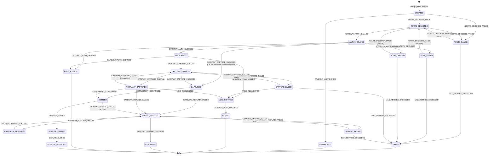

# Transaction State Machine — Architecture Document

## Overview

The payment transaction lifecycle is modeled as a strict Finite State Machine (FSM).
Every state transition is validated, logged to an immutable audit trail, and enforced at
the domain layer — before any database write occurs.

**Regulatory basis:** PCI-DSS v4.0 and RBI Master Direction on Payment Aggregators
require complete, immutable audit trails for all transaction state changes.

---

## State Diagram



---

## State Descriptions

| State | Phase | Description |
|-------|-------|-------------|
| `CREATED` | Initial | Transaction record created, no gateway interaction |
| `ABANDONED` | Terminal | Customer dropped off before completing payment |
| `ROUTE_SELECTED` | Routing | Optimal gateway selected by scoring algorithm |
| `ROUTE_FAILED` | Routing | No gateway available for this payment method |
| `AUTH_INITIATED` | Auth | Authorization request sent to gateway |
| `AUTHORISED` | Auth | Gateway confirmed authorization hold on funds |
| `AUTH_FAILED` | Auth | Gateway declined authorization (hard or soft decline) |
| `AUTH_TIMEOUT` | Auth | Gateway did not respond within timeout window |
| `AUTH_EXPIRED` | Terminal | Authorization hold period elapsed (5–7 days) |
| `CAPTURE_INITIATED` | Capture | Capture request sent to gateway |
| `CAPTURED` | Capture | Funds successfully transferred to merchant |
| `PARTIALLY_CAPTURED` | Capture | Partial amount captured (FS-05) |
| `CAPTURE_FAILED` | Capture | Capture attempt failed after successful auth |
| `VOID_INITIATED` | Void | Void request sent to gateway |
| `VOIDED` | Terminal | Authorization successfully voided |
| `REFUND_INITIATED` | Refund | Refund request submitted to gateway |
| `REFUNDED` | Terminal | Full refund processed |
| `PARTIALLY_REFUNDED` | Refund | Partial refund processed |
| `REFUND_FAILED` | Refund | Refund attempt failed |
| `SETTLED` | Settlement | Settlement confirmed by gateway |
| `FAILED` | Terminal | Terminal failure — no recovery possible |
| `DISPUTE_OPENED` | Dispute | Chargeback initiated |
| `DISPUTE_RESOLVED` | Terminal | Chargeback resolved |

---

## Transition Matrix (Condensed)

| From State | Valid Events | Valid Next States |
|------------|-------------|-------------------|
| CREATED | ROUTE_DECISION_MADE, ROUTE_DECISION_FAILED, PAYMENT_ABANDONED | ROUTE_SELECTED, ROUTE_FAILED, ABANDONED |
| ROUTE_SELECTED | GATEWAY_AUTH_CALLED, ROUTE_DECISION_FAILED | AUTH_INITIATED, ROUTE_FAILED |
| AUTH_INITIATED | GATEWAY_AUTH_SUCCESS/DECLINED/TIMEOUT/EXPIRED, GATEWAY_CAPTURE_SUCCESS | AUTHORISED, AUTH_FAILED, AUTH_TIMEOUT, AUTH_EXPIRED, CAPTURED |
| AUTHORISED | GATEWAY_CAPTURE_CALLED, GATEWAY_VOID_CALLED, GATEWAY_AUTH_EXPIRED | CAPTURE_INITIATED, VOID_INITIATED, AUTH_EXPIRED |
| CAPTURE_INITIATED | GATEWAY_CAPTURE_SUCCESS/PARTIAL/FAILED | CAPTURED, PARTIALLY_CAPTURED, CAPTURE_FAILED |
| CAPTURED | GATEWAY_REFUND_CALLED, SETTLEMENT_CONFIRMED | REFUND_INITIATED, SETTLED |
| SETTLED | GATEWAY_REFUND_CALLED, DISPUTE_RAISED | REFUND_INITIATED, DISPUTE_OPENED |

---

## Audit Trail Schema

Every transition writes an immutable record to `transaction_state_log`:

```
id               UUID        PK — unique audit entry
transaction_id   UUID        FK → transactions.id
from_state       ENUM        State before transition
to_state         ENUM        State after transition
event            ENUM        Event that triggered the transition
gateway_reference VARCHAR     Gateway's transaction/order ID
gateway_response JSONB       Full gateway response (PII redacted)
metadata         JSONB       Additional context (IP, retry count, etc.)
created_at       TIMESTAMPTZ Immutable timestamp
created_by       VARCHAR     System component that triggered the transition
```

**Immutability guarantee:** The audit log table has no UPDATE or DELETE grants for the
application user. Rows are INSERT-only. Corrections appear as new rows with
`event = RECONCILIATION_OVERRIDE`.

---

## Design Decisions

### Why pessimistic locking (SELECT FOR UPDATE)?

Payment state transitions involve:
1. Reading current state
2. Validating the transition
3. Calling an external gateway API (seconds of latency)
4. Writing the new state

If two concurrent processes read the same state simultaneously, both may attempt the same
transition. Pessimistic locking prevents this by holding a row lock during the critical section.

**Pattern used:** Acquire lock → validate state → update to intermediate state → release lock
→ call gateway → acquire lock → update to final state → release lock.

This ensures the gateway is never called twice for the same transaction.

### Why are financial amounts stored as BIGINT (paise)?

IEEE 754 floating-point arithmetic introduces rounding errors that compound across thousands
of transactions. `0.1 + 0.2 ≠ 0.3` in floating-point. For a system processing 100K
transactions/day with 5% refund rate, floating-point drift would create irreconcilable
discrepancies within weeks.

**Rule:** All monetary amounts are stored as `BIGINT` in the smallest currency unit (paise for
INR, cents for USD). The application layer converts for display: `display = amount_paise / 100`.
